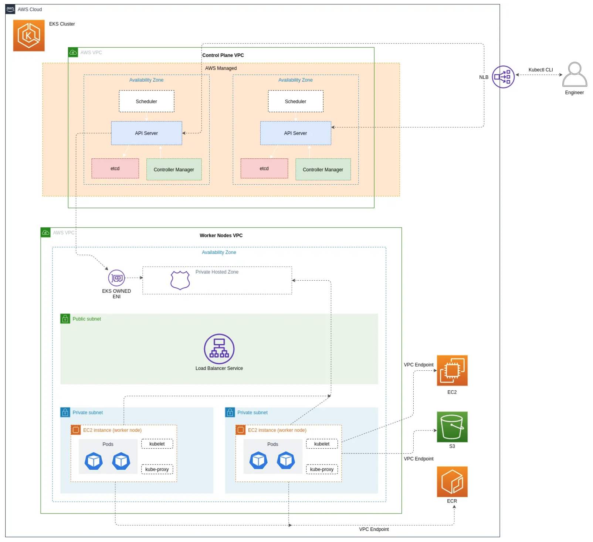

# AWS EKS Platform [Deprecated]
In this post, I’ll walk-through the creation of a cluster with a public and private network mode using Terraform all the way through to deploying an application in our cluster and making it publicly accessible through a load balancer.

This repository contains Terraform and Terragrunt source code to create an EKS cluster.
Please refer to this new repository for a more stable version: https://github.com/nholuongut/amazon-eks-cluster vs https://github.com/nholuongut/aws-eks-platform

## EKS Cluster Diagram for Setup Overview


## Prerequisites
I think this post will be most beneficial to you if you take a hands on approach. To do so, please make sure you have the following:

Foundational knowledge of Kubernetes and the Kubernetes cluster architecture
AWS account
AWS CLI tool installed (Linux, macOS, Windows)
Configured AWS profile with CLI
Docker CLI installed (not pertinent if you already have a Container image in ECR)
Terraform and Terragrunt installed
Kubernetes command line tool (kubectl)
 
## Setting up VPC Network Configuration
When you create an Amazon EKS cluster, you have to specify the VPC and subnets for your cluster to make use of. Amazon EKS requires subnets in at least two AZs. In this setup, we are going to have both public and private subnets. The public subnet will be used to create public load balancers that will direct traffic to pods running on the worker nodes in the private subnet. A subnet is public or private depending on whether or not traffic within the subnet is routed through an internet gateway. If the subnet’s traffic does not have a default route through an internet gateway, this subnet is considered to be private. 

Nodes with public or elastic IP addresses within a subnet configured with an internet gateway allow ingress from outside of the VPC. Your VPC must have DNS hostname and DNS resolution support. Otherwise, your worker nodes cannot register with your cluster.

When creating an Amazon EKS cluster (earlier than version 1.15), Amazon EKS tags the VPC containing the subnets you specify so that Kubernetes can discover it. We’ll be adding this tag in our Terraform code with the following key and value:

1. Key — The ``` kubernetes.io/<cluster-name>``` where the cluster-name value matches your Amazon EKS cluster's name.
2. Value — The ```shared``` value allows more than one cluster to use this VPC.

Furthermore, the VPC subnets also have tagging requirements. All subnets (public and private) that your cluster uses for resources should also have the above tag. In addition, the public and private subnets should each have certain tags that tell Kubernetes where to deploy internal (private) and external load balancers (public).

Public Subnet Tag:

Key — ``` kubernetes.io/role/elb ```

Value — ``` 1 ```

Private Subnet Tag:

Key — ``` kubernetes.io/role/internal-elb ```

Value  — ``` 1 ```

```resource "aws_vpc" "custom_vpc" {
  cidr_block= var.vpc_cidr_block
  # Your VPC must have DNS hostname and DNS resolution support. 
  # Otherwise, your worker nodes cannot register with your cluster. 
  enable_dns_support = true
  enable_dns_hostnames = true
tags = {
    Name = "${var.vpc_tag_name}-${var.environment}"
    "kubernetes.io/cluster/${var.eks_cluster_name}" = "shared"
  }
}```

### VPC Network Setup
# Create the private subnet
resource "aws_subnet" "private_subnet" {
  vpc_id            = "${aws_vpc.custom_vpc.id}"
  cidr_block = var.private_subnet_cidr_block
tags = {
    "kubernetes.io/cluster/${var.eks_cluster_name}" = "shared"
    "kubernetes.io/role/internal-elb" = 1
  }
}

# Create the public subnet
resource "aws_subnet" "public_subnet" {
  count = length(var.availability_zones)
  vpc_id            = "${aws_vpc.custom_vpc.id}"
  cidr_block = "${element(var.public_subnet_cidr_blocks, count.index)}"
  availability_zone = "${element(var.availability_zones, count.index)}"
  tags = {
    "kubernetes.io/cluster/${var.eks_cluster_name}" = "shared"
    "kubernetes.io/role/elb" = 1
  }
  map_public_ip_on_launch = true
}
# Create IGW for the public subnets
resource "aws_internet_gateway" "igw" {
  vpc_id = "${aws_vpc.custom_vpc.id}"
}
# Route the public subnet traffic through the IGW
resource "aws_route_table" "main" {
  vpc_id = "${aws_vpc.custom_vpc.id}"
route {
    cidr_block = "0.0.0.0/0"
    gateway_id = "${aws_internet_gateway.igw.id}"
  }
tags = {
    Name = "${var.route_table_tag_name}-${var.environment}"
  }
}
# Route table and subnet associations
resource "aws_route_table_association" "internet_access" {
  count = length(var.availability_zones)
  subnet_id      = "${aws_subnet.public_subnet[count.index].id}"
  route_table_id = "${aws_route_table.main.id}"
} 

## Network Mode Configuration
Another important preliminary step we have to consider before creating our cluster is deciding on the networking mode or the endpoint access control. You can configure the endpoint access control to determine whether your cluster is accessible form the Internet (public access), the VPC (private access) or both (public and private access). The communication between the worker nodes and the managed Kubernetes control plane is determined by the network mode configuration. Read this post for more details on this. In our case, we’re going to be configuring our cluster’s network to have both public and private endpoint access control.


Amazon EKS creates an Amazon Route 53 private hosted zone on your behalf, and then associates that private hosted zone only with your cluster’s VPC. The private hosted zone is managed by Amazon EKS, and the zone doesn’t appear in your account’s Route 53 resources. So this configruation will enable the following:


1. Kubernetes API requests within the cluster’s VPC (such as worker node to control plane communication) use the private VPC endpoint.
2. The cluster API server is accessible from the Internet.

## VPC Endpoints
Since we opted for the public and private network mode, our worker nodes won’t need outbound internet access for cluster introspection or node registration. Communication occurs through a managed EKS VPC Interface Endpoint. An interface endpoint is an elastic network interface with a private IP address from the IP address range of your subnet that serves as an entry point for traffic destined to a supported service.


VPC endpoints allow communication between instances in your VPC and AWS services without imposing availability risks or bandwidth constraints on your network traffic. Given this setup, the worker nodes running in the private subnet will also need access to other AWS services apart from the managed EKS control plane. We are going to use VPC Endpoints to privately connect our VPC to other AWS services, namely ECR, EC2 and S3.


We’re going to be setting up VPC endpoints for the following services:


1. AWS PrivateLink endpoint for ECR — This allows instances in your VPC to authenticate and communicate with ECR to download image manifests
2. Gateway VPC endpoint for Amazon S3 — This allows instances to download the image layers from the underlying private Amazon S3 buckets that host them.
3. AWS PrivateLink endpoint for EC2

``` # ECR
resource "aws_vpc_endpoint" "ecr_dkr" {
  vpc_id       = "${aws_vpc.custom_vpc.id}"
  service_name = "com.amazonaws.${var.region}.ecr.dkr"
  vpc_endpoint_type = "Interface"
  private_dns_enabled = true
  subnet_ids          = flatten([["${aws_subnet.private_subnet.id}"], aws_subnet.public_subnet.*.id])
security_group_ids = [aws_security_group.endpoint_ecr.id]
tags = {
    Name = "ECR Docker VPC Endpoint Interface - ${var.environment}"
    Environment = var.environment
  }
}
resource "aws_vpc_endpoint" "ecr_api" {
  vpc_id       = "${aws_vpc.custom_vpc.id}"
  service_name = "com.amazonaws.${var.region}.ecr.api"
  vpc_endpoint_type = "Interface"
  private_dns_enabled = true
  subnet_ids          = flatten([["${aws_subnet.private_subnet.id}"], aws_subnet.public_subnet.*.id])
security_group_ids = [aws_security_group.endpoint_ecr.id]
tags = {
    Name = "ECR API VPC Endpoint Interface - ${var.environment}"
    Environment = var.environment
  }
}
# EC2
resource "aws_vpc_endpoint" "ec2" {
  vpc_id       = "${aws_vpc.custom_vpc.id}"
  service_name = "com.amazonaws.${var.region}.ec2"
  vpc_endpoint_type = "Interface"
  private_dns_enabled = true
  subnet_ids          = flatten([["${aws_subnet.private_subnet.id}"], aws_subnet.public_subnet.*.id])
security_group_ids = [aws_security_group.endpoint_ec2.id]
tags = {
    Name = "EC2 VPC Endpoint Interface - ${var.environment}"
    Environment = var.environment
  }
}
# S3
resource "aws_vpc_endpoint" "s3" {
  vpc_id       = "${aws_vpc.custom_vpc.id}"
  service_name = "com.amazonaws.${var.region}.s3"
  vpc_endpoint_type = "Gateway"
  route_table_ids = [var.main_pvt_route_table_id]
tags = {
    Name = "S3 VPC Endpoint Gateway - ${var.environment}"
    Environment = var.environment
  }
} ```

## VPC Endpoint Security Groups

We also want to create security groups that we’ll attach to our VPC endpoint interface components. We want to allow communication between the VPC endpoint network interfaces and the resources in our VPC that communicate with other AWS services.

``` # EC2 VPC Endpoint security groups
resource "aws_security_group" "endpoint_ec2" {
  name   = "endpoint-ec2-sg"
  vpc_id = aws_vpc.custom_vpc.id
}
resource "aws_security_group_rule" "endpoint_ec2_443" {
  security_group_id = aws_security_group.endpoint_ec2.id
  type              = "ingress"
  from_port         = 443
  to_port           = 443
  protocol          = "tcp"
  cidr_blocks = flatten([[var.private_subnet_cidr_block], var.public_subnet_cidr_blocks])
}
# ECR VPC Endpoint security groups
resource "aws_security_group" "endpoint_ecr" {
  name   = "endpoint-ecr-sg"
  vpc_id = aws_vpc.custom_vpc.id
}
resource "aws_security_group_rule" "endpoint_ecr_443" {
  security_group_id = aws_security_group.endpoint_ecr.id
  type              = "ingress"
  from_port         = 443
  to_port           = 443
  protocol          = "tcp"
  cidr_blocks = flatten([[var.private_subnet_cidr_block], var.public_subnet_cidr_blocks])
} ```

## Creating The EKS Cluster

We’re getting to the core stages of what we set out to do. Before creating our cluster, we need to create an IAM role with specific IAM policies because the Kubernetes cluster managed by Amazon EKS makes calls to other AWS services on our behalf to manage the resources that are used with the service. So it will need the right permissions to execute these calls successfully.


After that, once the role has been created we can proceed to create the cluster. After which, we’ll need to create security groups for both the control plane as well as the worker node groups to allow for communication between the cluster’s Kubernetes control plane and the worker node groups.


Amazon EKS managed node groups are automatically configured to use the cluster security group but you can restrict the cluster traffic and limit the open ports between the control plane and the worker nodes which is what we’ll be doing.


So in this section we’ll be creating the following:
1. EKS Cluster IAM Role
2. EKS Cluster
3. EKS Cluster & Worker Node Security Groups


EKS Cluster IAM Role

``` resource "aws_iam_role" "eks_cluster" {
  name = "${var.eks_cluster_name}-cluster-${var.environment}"
assume_role_policy = <<POLICY
{
  "Version": "2012-10-17",
  "Statement": [
    {
      "Effect": "Allow",
      "Principal": {
        "Service": "eks.amazonaws.com"
      },
      "Action": "sts:AssumeRole"
    }
  ]
}
POLICY
}
resource "aws_iam_role_policy_attachment" "aws_eks_cluster_policy" {
  policy_arn = "arn:aws:iam::aws:policy/AmazonEKSClusterPolicy"
  role       = "${aws_iam_role.eks_cluster.name}"
}
resource "aws_iam_role_policy_attachment" "aws_eks_service_policy" {
  policy_arn = "arn:aws:iam::aws:policy/AmazonEKSServicePolicy"
  role       = "${aws_iam_role.eks_cluster.name}"
} ```

## EKS Cluster

``` resource "aws_eks_cluster" "main" {
  name     = var.eks_cluster_name
  role_arn = "${aws_iam_role.eks_cluster.arn}"
vpc_config {
    security_group_ids      = [aws_security_group.eks_cluster.id, aws_security_group.eks_nodes.id]
    endpoint_private_access = var.endpoint_private_access
    endpoint_public_access  = var.endpoint_public_access
    subnet_ids = var.eks_cluster_subnet_ids
  }
# Ensure that IAM Role permissions are created before and deleted after EKS Cluster handling.
  # Otherwise, EKS will not be able to properly delete EKS managed EC2 infrastructure such as Security Groups.
  depends_on = [
    "aws_iam_role_policy_attachment.aws_eks_cluster_policy",
    "aws_iam_role_policy_attachment.aws_eks_service_policy"
  ]
} ```

## EKS Cluster Security Group

``` resource "aws_security_group" "eks_cluster" {
  name        = var.cluster_sg_name
  description = "Cluster communication with worker nodes"
  vpc_id      = var.vpc_id
tags = {
    Name = var.cluster_sg_name
  }
}
resource "aws_security_group_rule" "cluster_inbound" {
  description              = "Allow worker nodes to communicate with the cluster API Server"
  from_port                = 443
  protocol                 = "tcp"
  security_group_id        = aws_security_group.eks_cluster.id
  source_security_group_id = aws_security_group.eks_nodes.id
  to_port                  = 443
  type                     = "ingress"
}
resource "aws_security_group_rule" "cluster_outbound" {
  description              = "Allow cluster API Server to communicate with the worker nodes"
  from_port                = 1024
  protocol                 = "tcp"
  security_group_id        = aws_security_group.eks_cluster.id
  source_security_group_id = aws_security_group.eks_nodes.id
  to_port                  = 65535
  type                     = "egress"
} ```

EKS Worker Node Group Security Group

``` resource "aws_security_group" "eks_nodes" {
  name        = var.nodes_sg_name
  description = "Security group for all nodes in the cluster"
  vpc_id      = var.vpc_id
egress {
    from_port   = 0
    to_port     = 0
    protocol    = "-1"
    cidr_blocks = ["0.0.0.0/0"]
  }
tags = {
    Name                                        = var.nodes_sg_name
    "kubernetes.io/cluster/${var.eks_cluster_name}" = "owned"
  }
}
resource "aws_security_group_rule" "nodes" {
  description              = "Allow nodes to communicate with each other"
  from_port                = 0
  protocol                 = "-1"
  security_group_id        = aws_security_group.eks_nodes.id
  source_security_group_id = aws_security_group.eks_nodes.id
  to_port                  = 65535
  type                     = "ingress"
}
resource "aws_security_group_rule" "nodes_inbound" {
  description              = "Allow worker Kubelets and pods to receive communication from the cluster control plane"
  from_port                = 1025
  protocol                 = "tcp"
  security_group_id        = aws_security_group.eks_nodes.id
  source_security_group_id = aws_security_group.eks_cluster.id
  to_port                  = 65535
  type                     = "ingress"
} ```

## Creating The Worker Node Groups
Similar to the cluster creation, we first need to create an IAM role for the worker nodes with specific IAM policies attached to it before they can be launched for use. What’s the reason in this particular case? The daemon kubelet on the worker nodes make calls to AWS APIs on our behalf and the nodes need this roles and necessary policies to have the right permissions for these API calls.

In this section we’ll be creating the following:
1. Worker Node Group IAM Role
2. Worker Node Groups for Public & Private Subnets
3. Worker Node Group IAM Role

``` resource "aws_iam_role" "eks_nodes" {
  name                 = "${var.eks_cluster_name}-worker-${var.environment}"
assume_role_policy = data.aws_iam_policy_document.assume_workers.json
}
data "aws_iam_policy_document" "assume_workers" {
  statement {
    effect = "Allow"
actions = ["sts:AssumeRole"]
principals {
      type        = "Service"
      identifiers = ["ec2.amazonaws.com"]
    }
  }
}
resource "aws_iam_role_policy_attachment" "aws_eks_worker_node_policy" {
  policy_arn = "arn:aws:iam::aws:policy/AmazonEKSWorkerNodePolicy"
  role       = aws_iam_role.eks_nodes.name
}
resource "aws_iam_role_policy_attachment" "aws_eks_cni_policy" {
  policy_arn = "arn:aws:iam::aws:policy/AmazonEKS_CNI_Policy"
  role       = aws_iam_role.eks_nodes.name
}
resource "aws_iam_role_policy_attachment" "ec2_read_only" {
  policy_arn = "arn:aws:iam::aws:policy/AmazonEC2ContainerRegistryReadOnly"
  role       = aws_iam_role.eks_nodes.name
}
resource "aws_iam_role_policy_attachment" "cluster_autoscaler" {
  policy_arn = aws_iam_policy.cluster_autoscaler_policy.arn
  role = aws_iam_role.eks_nodes.name
}
resource "aws_iam_policy" "cluster_autoscaler_policy" {
  name        = "ClusterAutoScaler"
  description = "Give the worker node running the Cluster Autoscaler access to required resources and actions"
policy = <<EOF
{
    "Version": "2012-10-17",
    "Statement": [
        {
            "Effect": "Allow",
            "Action": [
                "autoscaling:DescribeAutoScalingGroups",
                "autoscaling:DescribeAutoScalingInstances",
                "autoscaling:DescribeLaunchConfigurations",
                "autoscaling:DescribeTags",
                "autoscaling:SetDesiredCapacity",
                "autoscaling:TerminateInstanceInAutoScalingGroup"
            ],
            "Resource": "*"
        }
    ]
}
EOF
} ```

## Worker Node Groups for Public & Private Subnets

``` # Nodes in private subnets
resource "aws_eks_node_group" "main" {
  cluster_name    = aws_eks_cluster.main.name
  node_group_name = var.node_group_name
  node_role_arn   = aws_iam_role.eks_nodes.arn
  subnet_ids      = var.private_subnet_ids
ami_type       = var.ami_type
  disk_size      = var.disk_size
  instance_types = var.instance_types
scaling_config {
    desired_size = var.pvt_desired_size
    max_size     = var.pvt_max_size
    min_size     = var.pvt_min_size
  }
tags = {
    Name = var.node_group_name
  }
# Ensure that IAM Role permissions are created before and deleted after EKS Node Group handling.
  # Otherwise, EKS will not be able to properly delete EC2 Instances and Elastic Network Interfaces.
  depends_on = [
    aws_iam_role_policy_attachment.aws_eks_worker_node_policy,
    aws_iam_role_policy_attachment.aws_eks_cni_policy,
    aws_iam_role_policy_attachment.ec2_read_only,
  ]
}
# Nodes in public subnet
resource "aws_eks_node_group" "public" {
  cluster_name    = aws_eks_cluster.main.name
  node_group_name = "${var.node_group_name}-public"
  node_role_arn   = aws_iam_role.eks_nodes.arn
  subnet_ids      = var.public_subnet_ids
ami_type       = var.ami_type
  disk_size      = var.disk_size
  instance_types = var.instance_types
scaling_config {
    desired_size = var.pblc_desired_size
    max_size     = var.pblc_max_size
    min_size     = var.pblc_min_size
  }
tags = {
    Name = "${var.node_group_name}-public"
  }
# Ensure that IAM Role permissions are created before and deleted after EKS Node Group handling.
  # Otherwise, EKS will not be able to properly delete EC2 Instances and Elastic Network Interfaces.
  depends_on = [
    aws_iam_role_policy_attachment.aws_eks_worker_node_policy,
    aws_iam_role_policy_attachment.aws_eks_cni_policy,
    aws_iam_role_policy_attachment.ec2_read_only,
  ]
} ```

## Deploying & Exposing a Pod

Assuming you have run terragrunt apply or terraform apply and your cluster was successfully created and the node groups registered to it, we can now move to the next step which is to test an application on our cluster. To communicate with my cluster I’ll be using kubectl. The first step will be to create a Pod for our container to run in, and then expose (make publicly accessible) the containerised application using a Service.

Pod — the fundamental unit of deployment; it represents a running process of a scheduled unit and is a wrapper for one or more containers grouped together. Each pod is assigned a unique IP address and can expose ports. Labels are used to logically identify pods that match a criterion

Service — A service is an abstraction object on top of a group of pods like a load balancer. They routes traffic to pods in a round robin fashion. There are three types of services:
1. ClusterIP — Reachable from only within the cluster.
2. LoadBalancer — Exposes pods to external client traffic. Exposed over an external load balancer.
3. NodePort — Reachable from a exposed Node port.

## Connect To EKS Cluster

Make sure that you’ve got the right version of the AWS CLI installed. You can check by running the following command:

``` aws --version ```
Assuming you’ve got both the AWS CLI and kubectl installed, you can ensure that you’ve got the right AWS profile with the necessary permissions configured by running the following command:

 ``` aws sts get-caller-identity ```

 To create or update the kubeconfig file for your cluster, run the following command:

``` aws eks --region region update-kubeconfig --name your-cluster-name ```

You should be all setup and ready to make calls to your Cluster’s public API endpoint. If you would like to, you can read more about managing cluster authentication here. Run the following command to check for the current running worker nodes:

``` kubectl get nodes ```

## Label Node

I want to assign my Pod specifically to the node(s) running in the private subnet. A label is simply a key/value pair. To do this, I label the nodes with the following command:

``` kubectl label nodes <your-node-name> nodeType=privateNode ```

To ensure that your node was successfully labelled, you can run the following command to check the labels for each of the nodes:

``` kubectl get nodes --show-labels ```

Alternatively, you can view the details of the specific node you labelled:

``` kubectl describe node <your-node-name> ```

To pods to these nodes, we’ll make use of nodeSelector which is the simplest recommended form of node selection constraint. nodeSelector is a field of PodSpec.

## Create Pod & Service

Next up, I’ll be creating a pod with a container built from the image in the ECR repository. Below are the manifest files both for the pod being created, as well as the service that will expose it.

Pod
``` apiVersion: v1
kind: Pod
metadata:
  name: nodejs-express-pod
  labels:
    app: nodejs-express
spec:
  containers:
  - name: nodejs-express-container
    image: <image>
    ports:
      - containerPort: 8080
  nodeSelector:
    nodeType: privateNode # specify the node constraint which the pod should run on```

Service

```apiVersion: v1
kind: Service
metadata:
  name: nodejs-service
spec:
  selector:
    app: nodejs-express
  type: LoadBalancer
  ports:
  - protocol: TCP
    port: 8080
    targetPort: 8080` ``

Once you’ve saved your manifest files, you can go ahead and create them one at a time with the following command:

``` kubectl apply -f <manifest-file-name>.yml ```

To test that the pod and the service are each running as they should be, you can run the following commands:

``` kubectl get pods
kubectl get services ```

Since we created our service to be of type LoadBalancer, a Classic Load Balancer will be created in your AWS account and it will have an external or public IP address and a DNS name that you can use to access your application on the specified service port. In my case, the API request will be sent to the following address:

``` <prefix-characters-for-domain-name>.<aws-region>.elb.amazonaws.com:8080/test ```

Done!

 


